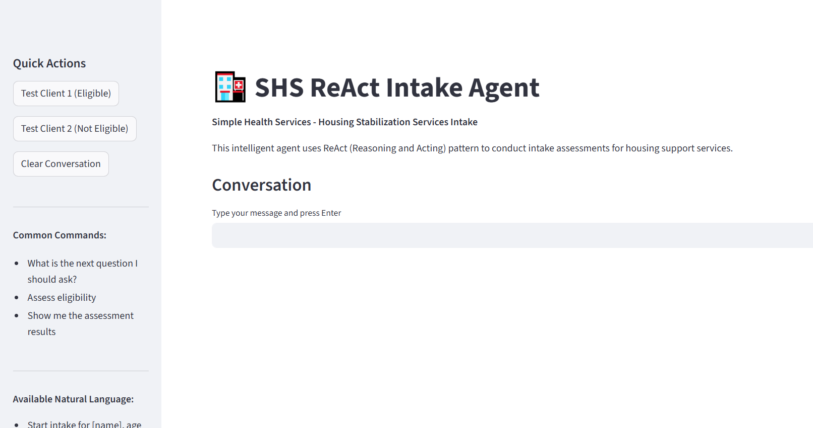
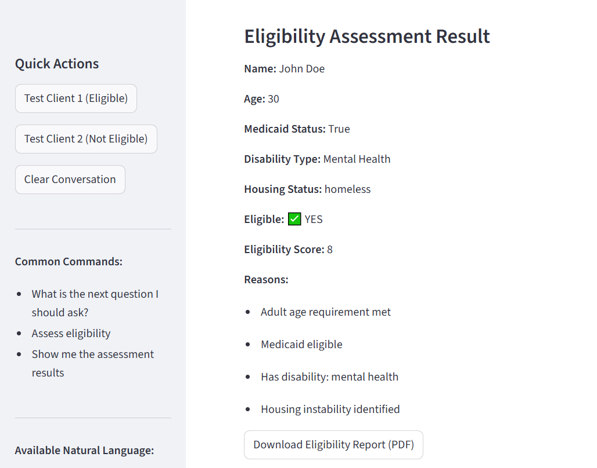
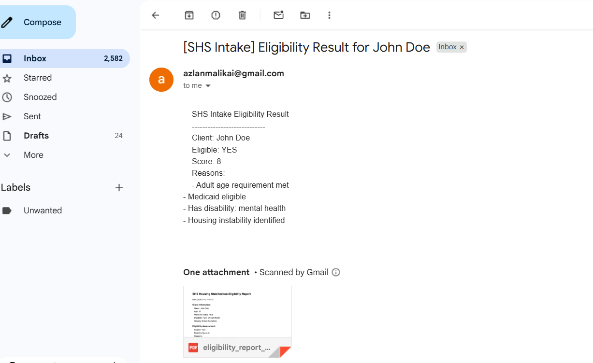

# 🏥 SHS Intake Agent

**Simple Health Services (SHS) – AI-Powered Housing Stabilization Intake**

---

## 🚀 Overview

The SHS Intake Agent is an AI-powered, agentic screener designed for Simple Health Services, a Minnesota nonprofit helping adults with disabilities and seniors access housing support. This tool automates the intake process, evaluates eligibility for housing programs, and delivers professional eligibility reports to staff—**all with a friendly, conversational interface**.

---

## ✨ Features

- **Conversational Intake:** Natural, step-by-step chat with clients
- **Eligibility Assessment:** Automated scoring based on Minnesota Medicaid rules
- **PDF Report Generation:** Clean, printable eligibility reports
- **Email Delivery:** Securely emails reports to staff (no unreliable webhooks)
- **Multiple Interfaces:**
  - Terminal CLI
  - Modern Gradio web UI
  - Professional Streamlit dashboard
- **Prebuilt Test Data:** For instant demos
- **Configurable & Secure:** Uses `.env` for all secrets and settings

---

## 🛠️ Tech Stack

- **Python 3.10+**
- [LangChain](https://github.com/langchain-ai/langchain) (ReAct agent, Google Gemini LLM)
- [Gradio](https://gradio.app/) (web UI)
- [Streamlit](https://streamlit.io/) (dashboard UI)
- [ReportLab](https://www.reportlab.com/) (PDF generation)
- **SMTP** (Gmail or custom) for email
- `.env` for configuration

---

## 📦 Project Structure

```
shs_intake_agent/
├── agent/
│   ├── intake_chain.py        # Agent logic (ReAct, tools, eligibility)
│   ├── intake_prompt.py       # System prompt & questions
│   ├── output_schema.py       # Pydantic schema
│   ├── generate_report.py     # PDF report generation
│   ├── send_email.py          # Email sending logic
├── main.py                    # CLI runner
├── gradio_ui.py               # Gradio web UI
├── streamlit_ui.py            # Streamlit dashboard UI
├── requirements.txt           # All dependencies
├── .env                       # Secrets & config (not tracked)
├── results/                   # Generated PDF reports
└── README.md                  # This file
```

---

## ⚙️ Setup & Installation

1. **Clone the repo & enter the directory:**
   ```sh
   git clone <your-repo-url>
   cd shs_intake_agent
   ```
2. **Create and activate a virtual environment:**
   ```sh
   python -m venv venv
   venv\Scripts\activate  # On Windows
   # or
   source venv/bin/activate  # On Mac/Linux
   ```
3. **Install dependencies:**
   ```sh
   pip install -r requirements.txt
   ```
4. **Set up your `.env` file:**
   ```env
   # .env example
   GOOGLE_API_KEY=your_google_gemini_api_key
   SMTP_EMAIL=your_email@gmail.com
   SMTP_PASSWORD=your_app_password
   EMAIL_TO=recipient@example.com
   ```

---

## 🖥️ Usage

### **Terminal CLI**
```sh
python main.py
```
- Follow the prompts, answer questions, or use natural language.
- After eligibility is scored, the agent **automatically generates a PDF and emails it to staff**.

### **Gradio Web UI**
```sh
python gradio_ui.py
```
- Open [http://localhost:7860](http://localhost:7860)
- Chat with the agent, use quick actions, download reports, and see email status.

### **Streamlit Dashboard**
```sh
streamlit run streamlit_ui.py
```
- Open [http://localhost:8501](http://localhost:8501)
- Enjoy a modern, step-by-step agentic experience with visual feedback and PDF download.

---

## 📝 Example Workflow

1. **Start a new intake:**
   - "Start intake for John Smith, age 45, with Medicaid, physical disability, at risk of homelessness"
2. **Answer questions or use prebuilt data**
3. **Agent scores eligibility, generates PDF, and emails staff**
4. **Download the PDF from the UI or check your email**

---

## 🔒 Security & Compliance
- All secrets are stored in `.env` (never commit this file!)
- Emails are sent securely via SMTP (Gmail or custom)
- No sensitive data is logged or exposed

---

## 📸 Screenshots





---

## 🤝 Contributing

Pull requests and suggestions are welcome! Please open an issue first to discuss changes.

---

## 📧 Contact

For questions or support, contact the SHS tech team or open an issue on GitHub.

---

**Built with ❤️ for Simple Health Services**
